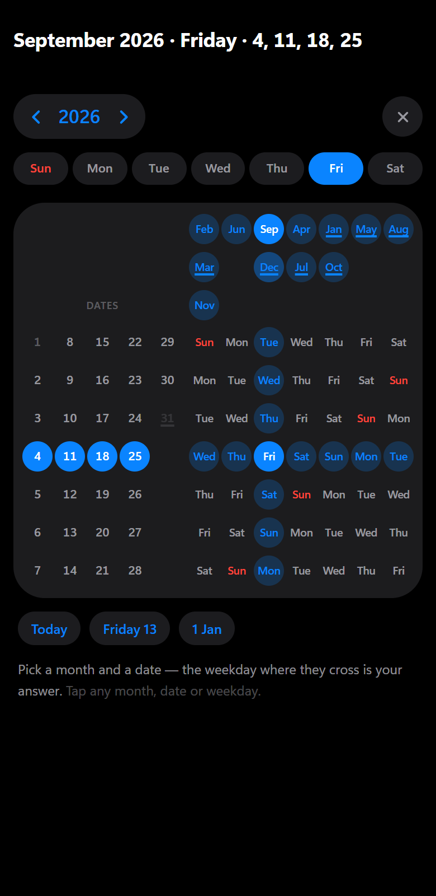
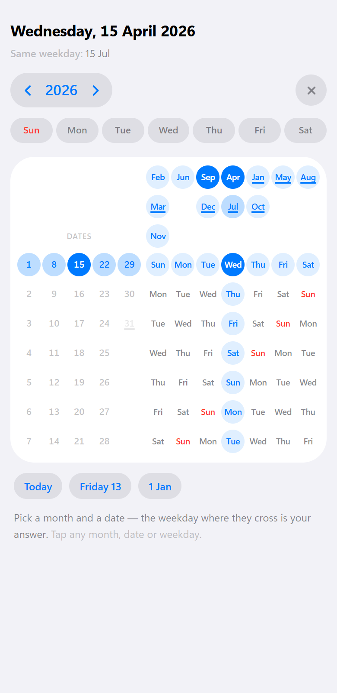

# One Page Calendar

A whole year on a single grid. No 12 month-blocks, no scrolling, no reprinting every January.

A conventional calendar spends 12 separate grids to encode one fact per date: *which weekday is it?* This app encodes the same year in **one 7×12 lookup table** — find the month's column, find the date's row, read the weekday where they cross. Change the year and only the month labels move; the rest of the grid never changes, because it can't.

Built with React 19, TypeScript 5, Vite 8 and Tailwind CSS 4, styled to iOS. Fully client-side: no backend, no date library, and **no runtime dependencies at all** beyond React — just `Date`, modular arithmetic, and hand-drawn SVG.




<p align="center">
  
  <br>
  <em>The same grid on a phone — upright, no rotation, no horizontal scroll.</em>
</p>

---

## The problems it solves

**1. "What weekday is the 25th?" costs a scroll and a scan.**
On a normal calendar you have to find the right month block, then visually walk the grid. Here it is one intersection: two coordinates, one cell.

**2. A year needs twelve grids — and next year needs twelve more.**
Each month block is 90% redundant with the others. This layout factors that redundancy out: the date block and weekday block are *year-invariant*, and only the 12 month labels re-flow when the year changes. That is why a single page works as a perpetual calendar.

**3. Cross-month patterns are invisible on a normal calendar.**
Months that start on the same weekday have byte-identical layouts — but on a normal calendar they sit pages apart, so you never notice. Here they literally stack in the same column. "Which months start on a Monday?" becomes a glance, not an audit. Useful for recurring schedules, shift rosters, and "same day next month" planning.

**4. Wall calendars don't fit a screen, a wallet, or a sidebar.**
The entire year is roughly a 12×7 table. It fits a phone screen, a business card, or a corner of a whiteboard.

**5. Mixed-language teams keep separate calendars.**
Month and weekday labels switch between **English / 中文 / Melayu / Tiếng Việt** without touching the layout — the grid is the same object in any language.

---

## How to read it

```
                     ┌─────┬─────┬─────┬─────┬─────┬─────┬─────┐
                     │ Feb │ Jun │ Sep │ Apr │ Jan │ May │ Aug │   ← months, dropped into the
                     │ Mar │     │ Dec │ Jul │ Oct │     │     │     column of the weekday
                     │ Nov │     │     │     │     │     │     │     they start on
 ┌───┬───┬───┬───┬───┼─────┼─────┼─────┼─────┼─────┼─────┼─────┤
 │ 1 │ 8 │15 │22 │29 │ Sun │ Mon │ Tue │ Wed │ Thu │ Fri │ Sat │
 │ 2 │ 9 │16 │23 │30 │ Mon │ Tue │ Wed │ Thu │ Fri │ Sat │ Sun │
 │ 3 │10 │17 │24 │31 │ Tue │ Wed │ Thu │ Fri │ Sat │ Sun │ Mon │
 │ 4 │11 │18 │25 │   │ Wed │ Thu │ Fri │ Sat │ Sun │ Mon │ Tue │
 │ 5 │12 │19 │26 │   │ Thu │ Fri │ Sat │ Sun │ Mon │ Tue │ Wed │
 │ 6 │13 │20 │27 │   │ Fri │ Sat │ Sun │ Mon │ Tue │ Wed │ Thu │
 │ 7 │14 │21 │28 │   │ Sat │ Sun │ Mon │ Tue │ Wed │ Thu │ Fri │
 └───┴───┴───┴───┴───┴─────┴─────┴─────┴─────┴─────┴─────┴─────┘
   dates 1–31                      each row is the week rotated by one
```

*(month placement shown for 2026)*

**Three steps:**

1. Find your **month** in the header → note its **column**.
2. Find your **date** in the left block → note its **row**.
3. The weekday cell at that **row × column** is your answer.

**Worked example — 25 December 2026.**
`Dec` sits in the **Tue** column (3rd). `25` sits in **row 4**. Row 4 × column 3 → **Fri**. December 25, 2026 is a Friday.

**Why it works.** For a month whose 1st falls on weekday `f`, the weekday of date `d` is `(f + d − 1) mod 7`. The layout splits that sum into two axes: the month column contributes `f`, the date row contributes `(d − 1) mod 7`, and row `r` of the weekday block is the week rotated left by `r` — so cell `[r][f]` holds exactly `weekdays[(f + r) mod 7]`. The `mod 7` on the date axis is why 1, 8, 15, 22, 29 share a row: they are the same weekday, always.

---

## Features

| | |
|---|---|
| **Any year, one grid** | Step the year with ◀ / ▶, or jump back with **Current Year**. Only the month labels re-flow. |
| **Today, triangulated** | The current month chip, today's date, and the weekday cell where they intersect are all highlighted at once. |
| **Crosshair tracing** | Hover or tap any weekday cell and it lights its full row and column — plus the matching months above and the matching dates to the left. The relationship the layout encodes becomes visible instead of implied. |
| **Tap to pin** | On touch devices a tap pins the crosshair until you tap again or press **Clear**, so the lookup survives lifting your finger. Cells are also `<button>`s, so Tab and Enter work. |
| **31-day markers** | Months with 31 days are underlined, as is date `31` — a reminder that not every column runs to the bottom. |
| **Elapsed day numbers dimmed** | In the current year, day numbers below today's are greyed out. This is a day-of-month comparison, not a date comparison — the date block is shared by all 12 months, so it dims the 3rd of December just as readily as the 3rd of January. See #4. |
| **Sunday in red** | Marked in every one of the seven row rotations, so the weekend edge stays findable wherever it lands. |
| **4 languages, by link** | English by default; `?lang=zh`, `?lang=ms` and `?lang=vi` switch it. The in-page switcher was removed to give the weekday filter that slot — the translations and the machinery are untouched, so restoring it is one component. Month lengths and the Sunday column key off indices, not translated strings, so adding a language means adding one entry. |
| **Mobile first, literally** | The 320px layout is the one the sizes are derived from — at that width each weekday column gets ~21px, which sets the cell metric everything else scales up from. Verified at 320/390/1024 in both appearances: zero horizontal overflow, and every cell measured as an exact circle. |
| **Two layouts, one DOM** | One column on a phone; from `lg`, the controls move into a left rail and the grid takes the width that frees. Placement is grid areas rather than duplicated markup, so tab order and screen-reader order stay the reading order at both widths. |
| **Nothing moves** | The readout changes on every hover, and its companion line comes and goes. Both live in one height-reserved block, so no amount of pointer movement shifts anything below the heading. The reservations are measured, not guessed — 45/65/57px across the three breakpoints — and re-verified at 3 widths × 4 languages. |
| **Works backwards** | The point of the layout. Any two of month, date and weekday fix the third, and all three are selectable — so it answers *"which months is the 15th a Wednesday?"* and *"which days in September are Fridays?"*, not just *"what day is 2 September?"*. A stack of twelve month-grids can only answer those by checking twelve grids; here the answer is one lit column or row. |
| **The title is the answer** | The page heading is the lookup itself. With nothing selected it reads today in full — *Wednesday, 2 September 2026*. Select a cell and it names exactly what that cell denotes: *January 2026 · Sunday · 4, 11, 18, 25*. Rendered through `Intl`, so month names, weekday names and field order are right in all four locales rather than hand-assembled. |
| **Fast year jump** | The year in the stepper is a native `<select>` spanning ±60 years — on iOS that is the system wheel picker, so crossing decades is one gesture instead of forty taps. The chevrons clamp to the same bounds. |
| **iOS design language** | Apple's published semantic colours (systemBlue, systemRed, the grouped backgrounds, the alpha label greys), SF Pro where it exists, fully rounded controls, and a segmented control for language. |
| **Light and dark** | Full dark appearance via `prefers-color-scheme`, driven entirely by CSS custom properties — not one `dark:` variant in the markup. |
| **No dependencies for the math** | Native `Date` only — no moment, no date-fns, no timezone surprises. 27 tests check the arithmetic against `Date` across 60 years, including the claim the whole UI rests on: the cell at (row of date, column of month) names that date's real weekday. |
| **SVG icons, inline** | The four glyphs are drawn to SF Symbols geometry in `icons.tsx`. No icon library, and stroke weights that match iOS rather than approximate it. |
| **Static by construction** | No backend, no network calls, no storage. Builds to plain files; deploys to GitHub Pages. |

---

## Quick start

```bash
git clone https://github.com/tanghoong/perpetual-calendars.git
cd perpetual-calendars
npm install
npm run dev
```

Open <http://localhost:5173>.

Node 20.19 or newer is required — Vite 8 drops support for anything older.

### Scripts

| Script | What it does |
|---|---|
| `npm run dev` | Vite dev server with HMR |
| `npm run build` | `tsc -b && vite build` → `dist/` |
| `npm run preview` | Serve the production build locally, at the real base path |
| `npm run lint` | ESLint over the repo |
| `npm run typecheck` | TypeScript, no emit |
| `npm test` | Vitest over the date arithmetic |

`lint`, `typecheck` and `test` are the three commands CI runs before it will build, so a green local run is a green PR.

### Project layout

```
src/
  components/CalendarBuilder.tsx   ← layout, interaction, state
  components/icons.tsx             ← inline SF-Symbols-shaped SVG glyphs
  lib/calendar.ts                  ← the date arithmetic, as pure functions
  lib/calendar.test.ts             ← 27 tests over it
  lib/i18n.ts                      ← the four translation tables
  lib/urlState.ts                  ← ?y=&lang=&m=&d=&w= round-tripping
  lib/format.ts                    ← cached Intl formatters
  index.css                        ← iOS semantic colour tokens, light + dark
  App.tsx                          ← renders CalendarBuilder
  main.tsx                         ← React root
public/icon.svg                    ← app icon / favicon
.github/workflows/deploy.yml       ← lint, typecheck, build, publish to Pages
.github/workflows/codeql.yml       ← CodeQL security analysis
.github/workflows/dependency-review.yml   ← blocks vulnerable deps in PRs
.github/dependabot.yml             ← weekly grouped dependency updates
```

Everything meaningful lives in `CalendarBuilder.tsx`. The parts worth knowing:

- `monthColumns` — seven buckets of **month indices**, keyed by the weekday each month starts on. Labels are looked up from `translations` only at render, so no logic depends on translated strings.
- `weekdayIndex = (col + row) % 7` — the entire weekday block is this one expression; row `r` is the week rotated left by `r`.
- `active = pinned ?? hovered` — one coordinate drives all three blocks' highlighting, which is why hovering a weekday also lights its months and dates. A pin beats a hover so touch selections survive stray pointer events.
- The date block renders an invisible mirror of the month grid as its top padding, so both blocks stay aligned at every breakpoint without hard-coded offsets.

---

## Known issues

Verified against a clean `npm ci` on this branch.

### Fixed

**1. `npm run lint` crashed.** ~~The lockfile resolved ESLint to 9.15 while `typescript-eslint` was pinned at `^8.7`.~~ Resolved by the toolchain upgrade: the lockfile was regenerated from scratch against ESLint 10 and `typescript-eslint` 8.69.

**2. `npm start` failed.** ~~`server.js` imported `express`, which was in neither `dependencies` nor the lockfile.~~ Resolved by deleting `server.js` and the `start` script. This is a static site; `npm run preview` already serves the production build locally, and it does so at the real base path, which an Express `express.static` root did not.

### Deployment

**3. The favicon was still `vite.svg`, and there were no Open Graph tags.** ~~A tool distributed mainly by shared link deserves its own icon and a link preview.~~ Mostly resolved: `public/icon.svg` is now the favicon and the Apple touch icon — the app's own idea as a mark, a row and a column crossing — and `index.html` carries Open Graph, Twitter, `theme-color` (per appearance) and the Home Screen meta.

What is still open is a raster **Open Graph image**. `og:image` wants a ~1200×630 PNG; several crawlers will not render an SVG, and this repo has no build step that produces one.

### Correctness and UX

**4. The date axis is month-agnostic, but two features treat it as month-specific.**
The date block always shows 1–31 for every month. February (28/29) and the 30-day months aren't masked, and leap years get no indication — the reader has to supply that knowledge.

The same gap makes `isPastDate()` misleading: it tests `num < currentDate`, a day-of-month comparison on cells that belong to all twelve months at once. Late in a month it dims day numbers that are still in the future for every later month, while the 29th–31st of already-elapsed months stay undimmed. `isToday()` has the same shape. Both read as "past/today" but only mean "lower-numbered than today".

Dimming out-of-range and elapsed dates relative to a *hovered or selected month* would fix the month-length gap and the comparison gap together.

**Partly addressed.** The title readout now does exactly this arithmetic: it resolves the selection to a concrete month and filters the row's dates against that month's real length, so it will never claim a 31st of September. Verified against `Date` across all seven columns. The *grid* still shows an unmasked 1–31, so the gap is now confined to the cells rather than the whole feature.

**5. Accessibility is improved but incomplete.**
Weekday cells are `<button>`s: keyboard reachable, `aria-pressed` reflects the pin, and each carries a full weekday name via `aria-label`. The language control is a `<fieldset>` of real radio inputs — it looks like an iOS segmented control but keeps native group semantics and native arrow-key navigation, which an `aria-pressed` button set would have had to reimplement. Focus is a visible `outline` on every control. What is still missing is grid semantics — the layout is CSS grid, not a table, so a screen reader is not told that a given weekday cell sits at the intersection of a date row and a month column, which is the whole point of the design. A `role="grid"` treatment with row/column headers would close it. ~~plus an `aria-live` readout of the current lookup~~ — that half is done: the heading *is* the readout and carries `aria-live="polite"`, so moving through cells by keyboard announces the resolved date set rather than a bare weekday. State is also still conveyed largely by colour.

**6. Nothing is persisted or shareable.**
Year and language reset on every reload. Reading them from the URL (`?year=2027&lang=zh`) and mirroring to `localStorage` would make a specific view linkable.

**7. No print stylesheet.**
For a calendar whose entire premise is fitting on one page, `@media print` is a conspicuous omission.

### Housekeeping

**8. ~~Boilerplate residue.~~** Resolved — `src/App.css`, `src/assets/react.svg` and `public/vite.svg` are all deleted, and `App.tsx` no longer wraps the component in a pointless `<div>`.
**9. No tests.** The month bucketing and the weekday rotation are pure index arithmetic — trivial to extract and test, and they are the part that must never be wrong.
**10. No LICENSE file.** The previous README advertised MIT, but no license file was ever committed. See [License](#license).

---

## Deployment

The site is a static bundle published to GitHub Pages by
`.github/workflows/deploy.yml`, using GitHub's first-party Pages actions. It
runs two jobs.

**`build`** runs on pushes and pull requests alike: `npm ci`, then `npm run
lint`, then `npm run typecheck`, then `npm run build`, then uploads `dist/` as
a Pages artifact. Lint and typecheck run *before* the build, so a PR with a type
error fails in seconds rather than after a full bundle.

**`deploy`** runs only on `main`. Its one step is `actions/deploy-pages`, which
publishes the artifact through the `github-pages` environment over OIDC. There
is no `gh-pages` branch, no long-lived token, and no repository secret.

### Least privilege

The workflow's default grant is `permissions: {}` — empty. Each job opts into
exactly what it needs: `build` gets `contents: read` and `pages: read`;
`deploy` gets `pages: write` and `id-token: write`.

That split is the point. The workflow also triggers on `pull_request`, and PR
builds execute PR-controlled npm lifecycle scripts and build code. A single-job
version would hand publish-capable credentials to every PR build. An `if` on the
deploy *step* would not help either, because earlier steps in the same job would
still hold the token. Only `deploy` can publish, and nothing PR-controlled runs
there. Every checkout also uses `persist-credentials: false`, so no token is
left behind in `.git/config`.

### The base path

The site serves from `https://tanghoong.github.io/perpetual-calendars/`, so the
built asset URLs need that prefix or they 404. `vite.config.ts` reads it from
`BASE_PATH`, which CI supplies from `actions/configure-pages` — that action
resolves the repository's *actual* Pages base path, so a fork or a rename keeps
working with no code edit. The literal `/perpetual-calendars/` in
`vite.config.ts` is only the local fallback.

`npm run preview` honours the same base, so the local production check hits the
same URLs the deployed site does.

### One-time repository setup

These cannot be done from files. In the repository's web UI:

1. **Settings → Pages → Source → GitHub Actions.** Required. The workflow uses
   the Pages artifact API, which does nothing while the source is still set to
   "Deploy from a branch". If this repo was previously deploying from a
   `gh-pages` branch, this switch is the migration — after it, the old branch
   is dead weight and can be deleted.
2. **Settings → Code security → enable** Dependabot alerts, Dependabot security
   updates, secret scanning, and push protection.
3. **Settings → Code security → Private vulnerability reporting → enable**, so
   `SECURITY.md` has a working channel to point at.
4. **Settings → Rules → Rulesets** — protect `main`: require a pull request,
   and require the `Build`, `Analyze JavaScript/TypeScript`, and
   `Review dependency changes` checks to pass.

Step 1 is required for the site to deploy at all. Steps 2–4 are what make the
security workflows enforcing rather than advisory.

---

## Security

See [SECURITY.md](SECURITY.md) for the threat model, the reporting channel, and
the full control list. In short: CodeQL on every push and weekly, dependency
review blocking vulnerable packages in PRs, grouped Dependabot updates for both
npm and the workflow actions, and empty-by-default workflow permissions.

---

## Contributing

Issues and pull requests are welcome. The [Known issues](#known-issues) list is roughly in priority order — items 1–2 are small, self-contained, and unblock everyone else.

---

## License

No license file is currently committed, so default copyright applies — the code is not yet licensed for reuse. If MIT is the intent (as an earlier draft of this README stated), adding a `LICENSE` file would make it official.
