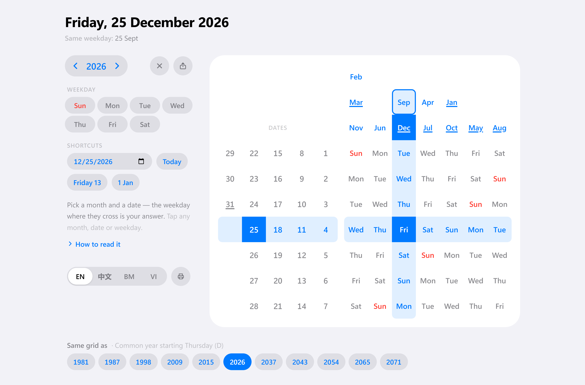

# One Page Calendar

A whole year on a single grid. No 12 month-blocks, no scrolling, no reprinting every January.

A conventional calendar spends 12 separate grids to encode one fact per date: *which weekday is it?* This app encodes the same year in **one 7×12 lookup table** — find the month's column, find the date's row, read the weekday where they cross. Change the year and only the month labels move; the rest of the grid never changes, because it can't.

Built with React + TypeScript + Vite + Tailwind. Fully client-side, no backend, no date library — just `Date` and modular arithmetic.



---

## The problems it solves

**1. "What weekday is the 25th?" costs a scroll and a scan.**
On a normal calendar you have to find the right month block, then visually walk the grid. Here it is one intersection: two coordinates, one cell.

**2. A year needs twelve grids — and next year needs twelve more.**
Each month block is 90% redundant with the others. This layout factors that redundancy out: the date block and weekday block are *year-invariant*, and only the 12 month labels re-flow when the year changes. That is why a single page works as a perpetual calendar.

**3. Cross-month patterns are invisible on a normal calendar.**
Months that start on the same weekday have byte-identical layouts — but on a normal calendar they sit pages apart, so you never notice. Here they literally stack in the same column. "Which months start on a Monday?" becomes a glance, not an audit. Useful for recurring schedules, shift rosters, and "same day next month" planning.

**4. Wall calendars don't fit a screen, a wallet, or a sidebar.**
The entire year is roughly a 12×7 table. It fits a phone screen, a business card, or a corner of a whiteboard.

**5. Mixed-language teams keep separate calendars.**
Month and weekday labels switch between **English / 中文 / Melayu / Tiếng Việt** without touching the layout — the grid is the same object in any language.

---

## How to read it

```
                     ┌─────┬─────┬─────┬─────┬─────┬─────┬─────┐
                     │ Feb │ Jun │ Sep │ Apr │ Jan │ May │ Aug │   ← months, dropped into the
                     │ Mar │     │ Dec │ Jul │ Oct │     │     │     column of the weekday
                     │ Nov │     │     │     │     │     │     │     they start on
 ┌───┬───┬───┬───┬───┼─────┼─────┼─────┼─────┼─────┼─────┼─────┤
 │ 1 │ 8 │15 │22 │29 │ Sun │ Mon │ Tue │ Wed │ Thu │ Fri │ Sat │
 │ 2 │ 9 │16 │23 │30 │ Mon │ Tue │ Wed │ Thu │ Fri │ Sat │ Sun │
 │ 3 │10 │17 │24 │31 │ Tue │ Wed │ Thu │ Fri │ Sat │ Sun │ Mon │
 │ 4 │11 │18 │25 │   │ Wed │ Thu │ Fri │ Sat │ Sun │ Mon │ Tue │
 │ 5 │12 │19 │26 │   │ Thu │ Fri │ Sat │ Sun │ Mon │ Tue │ Wed │
 │ 6 │13 │20 │27 │   │ Fri │ Sat │ Sun │ Mon │ Tue │ Wed │ Thu │
 │ 7 │14 │21 │28 │   │ Sat │ Sun │ Mon │ Tue │ Wed │ Thu │ Fri │
 └───┴───┴───┴───┴───┴─────┴─────┴─────┴─────┴─────┴─────┴─────┘
   dates 1–31                      each row is the week rotated by one
```

*(month placement shown for 2026)*

**Three steps:**

1. Find your **month** in the header → note its **column**.
2. Find your **date** in the left block → note its **row**.
3. The weekday cell at that **row × column** is your answer.

**Worked example — 25 December 2026.**
`Dec` sits in the **Tue** column (3rd). `25` sits in **row 4**. Row 4 × column 3 → **Fri**. December 25, 2026 is a Friday.

**Why it works.** For a month whose 1st falls on weekday `f`, the weekday of date `d` is `(f + d − 1) mod 7`. The layout splits that sum into two axes: the month column contributes `f`, the date row contributes `(d − 1) mod 7`, and row `r` of the weekday block is the week rotated left by `r` — so cell `[r][f]` holds exactly `weekdays[(f + r) mod 7]`. The `mod 7` on the date axis is why 1, 8, 15, 22, 29 share a row: they are the same weekday, always.

---

## Features

| | |
|---|---|
| **Any year, one grid** | Step the year with ◀ / ▶, or jump back with **Current Year**. Only the month labels re-flow. |
| **Today, triangulated** | The current month chip, today's date, and the weekday cell where they intersect are all highlighted at once. |
| **Crosshair tracing** | Hovering any weekday cell lights its full row and column, so you can follow a lookup without losing your place. |
| **31-day markers** | Months with 31 days are underlined, as is date `31` — a reminder that not every column runs to the bottom. |
| **Elapsed day numbers dimmed** | In the current year, day numbers below today's are greyed out. This is a day-of-month comparison, not a date comparison — the date block is shared by all 12 months, so it dims the 3rd of December just as readily as the 3rd of January. See #4. |
| **Sunday in red** | Across all 7 rotations, so the weekend edge stays findable in a rotated grid. |
| **4 languages** | English · 中文 · Melayu · Tiếng Việt, switchable live. |
| **No dependencies for the math** | ~270 lines, native `Date` only — no moment, no date-fns, no timezone surprises. |
| **Static by construction** | No backend, no network calls, no storage. Builds to plain files; deploys to GitHub Pages. |

---

## Quick start

```bash
git clone https://github.com/tanghoong/perpetual-calendars.git
cd perpetual-calendars
npm install
npm run dev
```

Open <http://localhost:5173>.

> **Heads up:** `npm run lint` and `npm start` still fail on a clean checkout. `npm run dev` and `npm run build` work. See [Known issues](#known-issues) for the one-line fixes.

### Scripts

| Script | What it does | Status |
|---|---|---|
| `npm run dev` | Vite dev server with HMR | ✅ works |
| `npm run build` | `tsc -b && vite build` → `dist/` | ✅ works |
| `npm run preview` | Serve the production build locally | ✅ works |
| `npm run lint` | ESLint over the repo | ❌ crashes — see #1 |
| `npm start` | Serve `dist/` via Express | ❌ fails — see #2 |
| `npm run deploy` | `gh-pages -d dist` | ✅ works |

### Project layout

```
src/
  components/CalendarBuilder.tsx   ← the entire app: layout, date math, i18n
  App.tsx                          ← renders CalendarBuilder
  main.tsx                         ← React root
.github/workflows/deploy.yml       ← build + publish to gh-pages on push to main
server.js                          ← optional Express static server
```

Everything meaningful lives in `CalendarBuilder.tsx`. The functions worth knowing:

- `getMonthPositions(year)` — buckets the 12 months into 7 columns by their first weekday.
- `generateWeekdayGrid()` — builds the 7×7 rotation block.
- `isHighlighted()` — resolves hover crosshair vs. today's intersection.

---

## Known issues

Verified against a clean `npm ci` on this branch. The first two block the standard workflow, so they're listed with their fixes.

### Blocking

**1. `npm run lint` crashes.**
The lockfile resolves ESLint to 9.15 while `typescript-eslint` is pinned at `^8.7`; the `no-unused-expressions` rule then throws `Cannot read properties of undefined (reading 'allowShortCircuit')`. Bump `typescript-eslint` to `^8.15`.

**2. `npm start` fails.**
`server.js` does `import express from 'express'`, but `express` is in neither `dependencies` nor the lockfile. Either add it or drop `server.js` — `npm run preview` already covers local production serving.

### Deployment

**3. The favicon is still `vite.svg`, and there are no Open Graph tags.**
The title and description are set, but a tool distributed mainly by shared link deserves its own icon and a link preview.

### Correctness and UX

**4. The date axis is month-agnostic, but two features treat it as month-specific.**
The date block always shows 1–31 for every month. February (28/29) and the 30-day months aren't masked, and leap years get no indication — the reader has to supply that knowledge.

The same gap makes `isPastDate()` misleading: it tests `num < currentDate`, a day-of-month comparison on cells that belong to all twelve months at once. Late in a month it dims day numbers that are still in the future for every later month, while the 29th–31st of already-elapsed months stay undimmed. `isToday()` has the same shape. Both read as "past/today" but only mean "lower-numbered than today".

Dimming out-of-range and elapsed dates relative to a *hovered or selected month* would fix the month-length gap and the comparison gap together.

**5. i18n logic matches on translated strings, not indices.**
`hasThirtyOneDays()` keeps four parallel arrays of localized month names, and the Sunday-red test is a string check (`day.includes('Sun') || day.includes('周日') || day.includes('Ahd') || day === 'CN'`). Adding a fifth language means editing string lists in two more places, and any label collision across locales silently mis-renders. Both should key off the month/weekday **index**, which is already available.

**6. The crosshair is hover-only.**
`onMouseEnter`/`onMouseLeave` means touch and keyboard users get no tracing aid at all — on mobile, the single most useful interaction is simply absent. Tap-to-pin plus focus/arrow-key navigation would fix both.

**7. The mobile layout is a rotation hack.**
Below 768px the whole component is `rotate(90deg) translate(0,-100%)`, which turns the page sideways rather than reflowing. It breaks scroll direction and text selection. A responsive grid or horizontal scroll container would behave properly.

**8. Accessibility gaps.**
The grid is a `<table>` with no `<th>`, `<caption>`, or `scope` attributes, so screen readers can't announce the row/column relationship the entire design depends on. State (today, past, highlighted) is conveyed by color alone, and the language `<select>` has no associated label.

**9. Nothing is persisted or shareable.**
Year and language reset on every reload. Reading them from the URL (`?year=2027&lang=zh`) and mirroring to `localStorage` would make a specific view linkable.

**10. No print stylesheet.**
For a calendar whose entire premise is fitting on one page, `@media print` is a conspicuous omission.

### Housekeeping

**11. Boilerplate residue.** `src/App.css` still ships an unused `.spin-slow` animation; `src/assets/react.svg` and `public/vite.svg` are unused.
**12. No tests.** The date math (`getMonthPositions`, `generateWeekdayGrid`) is pure and takes a number, returns an array — near-zero-friction to test, and it's the part that must never be wrong.
**13. No LICENSE file.** The previous README advertised MIT, but no license file was ever committed. See [License](#license).

---

## Deployment

`.github/workflows/deploy.yml` runs two jobs. `build` compiles the app and uploads `dist/` as an artifact; it runs for pushes and pull requests alike. `deploy` runs only when the ref is `main`, downloads that artifact, and publishes it to the `gh-pages` branch via `peaceiris/actions-gh-pages`, authenticating with the built-in `GITHUB_TOKEN` — no repository secret to configure.

The split exists for least privilege. The workflow's default grant is `contents: read`, and only `deploy` opts into `contents: write`. Since the workflow also triggers on `pull_request`, a single-job version would hand a write-capable token to every PR build — and PR builds execute PR-controlled npm lifecycle scripts and build code. An `if` on the deploy step would not help, because the earlier steps in the same job still hold the token. The `build` job also checks out with `persist-credentials: false` so no token is left behind in `.git/config`.

The site serves from `https://tanghoong.github.io/perpetual-calendars/`, which is why `vite.config.ts` sets `base: '/perpetual-calendars/'`. Changing the repository name means changing that base, or the built asset URLs will 404.

One manual step remains, and it can only be done in the web UI: **Settings → Pages → Source → Deploy from a branch → `gh-pages` / root.** Until that is set, the workflow will publish the branch but GitHub will not serve it.

Manual alternative:

```bash
npm run deploy   # runs predeploy → build, then pushes dist/ to gh-pages
```

---

## Contributing

Issues and pull requests are welcome. The [Known issues](#known-issues) list is roughly in priority order — items 1–2 are small, self-contained, and unblock everyone else.

---

## License

No license file is currently committed, so default copyright applies — the code is not yet licensed for reuse. If MIT is the intent (as an earlier draft of this README stated), adding a `LICENSE` file would make it official.
